# stock-concurrency

---

멀티 스레드 환경에서 여러 스레드가 동시에 동일한 자원에 접근하고 변경하게 되면 데이터의 일관성이 깨져 의도와는 다르게 동작할 수 있다.

이전 프로젝트에서도 결제가 완료될 경우에 재고를 차감하는 로직이 존재했는데 동시성 문제에 대한 처리를 별도로 하지 않았었다. (잘 몰랐기 때문에...)

동시성 문제에 대해서 잘 알지 못했었기 때문에 이 레포지토리를 통해서 어떻게 해결할 수 있는지 정리하려고 한다.

> 각 브랜치로 이동해 실행 결과를 확인할 수 있다.

---

[Stock.java](/src/main/java/com/hun3/domain/Stock), [StockService.java](/src/main/java/com/hun3/service/StockService.java), [StockRepository.java](/src/main/java/com/hun3/repository/StockRepository.java), [StockServiceTest.java](/src/test/java/com/hun3/service/StockServiceTest.java) 
와 같이 간단한 재고를 차감하는 코드를 만들어보자.

테스트 코드를 살펴보면 100개의 스레드가 동시에 재고를 차감하는 동작을 수행한다.
우리가 기대하는 것은 한 스레드가 하나의 재고를 차감해 남은 재고는 0개일 것으로 기대했지만,

```java
@Test
    void decrease_stock_100_times_concurrently() throws InterruptedException {

        int threadCount = 100;
        ExecutorService executorService = Executors.newFixedThreadPool(threadCount);
        CountDownLatch latch = new CountDownLatch(threadCount);

        for (int i = 0; i < threadCount; i++) {
            executorService.submit(() -> {
               try {
                   stockService.decrease(1L, 1L);
               } finally {
                   latch.countDown();
               }
            });
        }

        latch.await();

        Stock stock = stockRepository.findByProductId(1L);
        assertEquals(0, stock.getQuantity());
    }
```

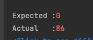

86개의 재고가 남아 테스트가 실패했다.

## 발생 원인

왜 이런 동시성 문제가 발생했을까?

두 개 이상의 스레드가 재고라는 공유 자원에 동시에 접근하고 변경하면서 Race Condition이 발생했기 때문이다.

우리가 기대했던 동작의 흐름을 살펴보자.
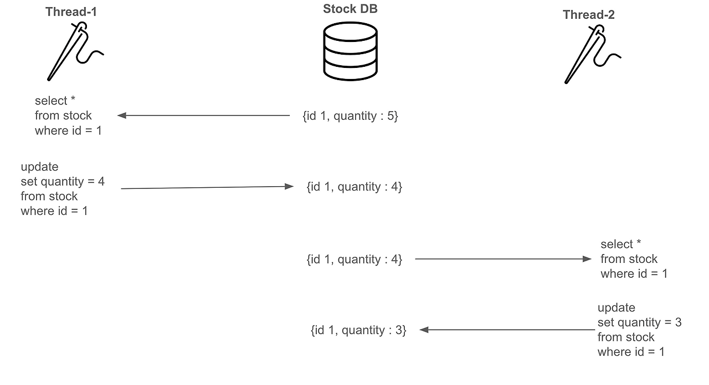

한 스레드 별로 순차적으로 값을 읽고 변경할 것으로 기대했지만,

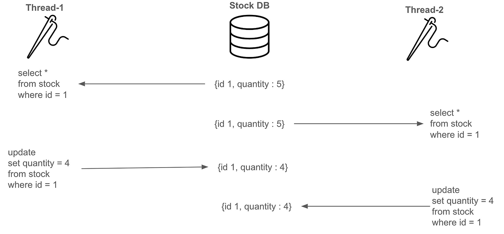

실제로는 한 Thread가 재고를 조회하고 차감 시킨 후 반영하기 전에 다른 Thread가 동일한 값을 조회한다.
그래서 앞선 Thread가 작업한 결과가 사라지는 Lost Update가 발생한다.

이를 해결하기 위해선 하나의 Thread가 작업이 완료된 이후에 다른 Thread가 데이터에 접근할 수 있도록 제어해야 한다.
동시성 문제를 어떻게 해결할 수 있을지 알아보자.

---

## 1. Application Level

Java에는 동시성 문제를 해결하는 `synchronized` 키워드가 존재한다.

해당 키워드를 사용해서 Java Application Level에서 해결해보자.

```java
@Service
@RequiredArgsConstructor
public class StockService {

    private final StockRepository stockRepository;

    @Transactional
    public synchronized void decrease(Long productId, Long quantity) {
        Stock stock = stockRepository.findByProductId(productId);
        stock.decrease(quantity);
        stockRepository.save(stock);
    }

}
```

`synchronized` 키워드를 사용해서 한 개의 Thread 씩 처리하도록 설정했다.

이제 이전에 작성했던 테스트 코드를 실행해 100개의 요청을 실행해보자.

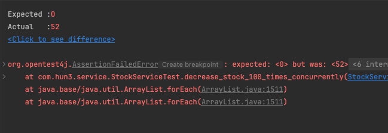

하지만 여전히 실패한다.

왜 실패 했을까?
이유를 알기 위해서는 `@Transactional` 어노테이션의 동작 방식에 대해서 이해해야 한다.
`@Transactional` 어노테이션은 Spring AOP 방식으로 동작하는데 해당 클래스를 감싼 프록시 객체를 생성해 메소드를 호출한다.

동작을 코드로 표현한다면 아래와 같지 않을까?
```java
public class StockServiceProxy {
    
    private StockService stockService;
    
    public StockServiceProxy(StockService stockService) {
        this.stockService = stockService;
    }
    
    public void decrease(Long id, Long quantity) {
        startTx();
        
        stockService.decrease(id, quantity);
        
        endTx();
    }
}
```

Proxy 객체가 트랜잭션의 작업을 데이터베이스에 반영하기 이전에 다른 트랜잭션에서 재고를 조회하기 때문에 문제가 발생한다.

그래서 `@Transactional` 어노테이션을 지우고 실행하면 정상적으로 동작한다.
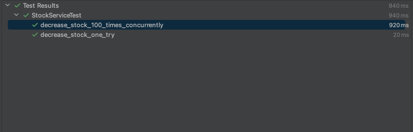

'그렇다면 `@Transcational` 어노테이션을 사용하지 않으면 되는거 아닌가?' 라고 생각할 수 있다.

명심하자. `synchronized` 키워드는 한 프로세스에서만 보장된다.
서버가 여러대인 경우 여러 서버에서 공유 자원에 접근할 수 있기 떄문에 동기화를 보장하지 않는다.

이런 이유로 Application Level에서 해결하기는 적합한 방법은 아닌거 같다.

---

## 2. Database Lock

데이터베이스는 데이터에 접근을 제한해 데이터 정합성을 맞추는 Lock 이라는 기능을 제공하는데,
크게 `비관적 락 Pessimistic Lock`, `낙관적 락 Optimistic Lock`, `네임드 락 Named Lock`이 있다.

각 방식의 동작을 살펴보고 동시성 문제를 해결하는데 적용해보자.

### Pessimistic Lock

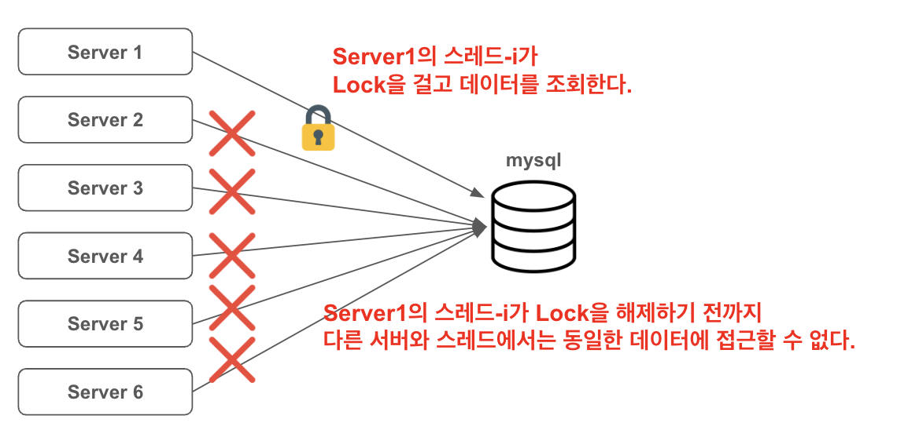

데이터베이스 테이블이나 로우에 직접 락을 걸어 다른 사용자가 접근하지 못하게 막는 방식이다.

가장 직관적인 방법으로 제한할 수 있지만
여러 스레드가 서로 락을 얻기 위해 대기하는 데드락에 빠질 수 있으므로 주의해야 한다.

실제 비관적 락의 동작을 확인하면

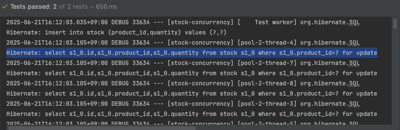

`SELECT ... FOR UPDATE` 쿼리를 통해서 락을 걸로 데이터를 조회하는 것을 확인할 수 있다.

데이터 조회 시점에 별도의 Lock을 걸기 때문에 충돌이 많이 발생하지 않는다면 성능 감소로 이어질 수 있다.

### Optimistic Lock

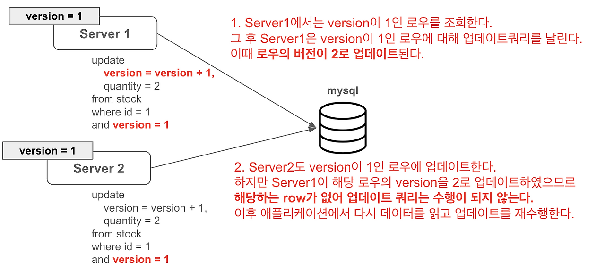

데이터의 버전을 이용해 정합성을 맞추는 방법이다.
데이터를 읽을 때 버전을 함께 조회해 작업을 반영하기 전에 데이터의 버전이 일치하는지 확인한다.

실제 낙관적 락을 통해 락을 걸고 이전에 작성한 테스트 코드를 실행해보자.

```java
    @Lock(LockModeType.OPTIMISTIC)
    @Query("select s from Stock s where s.productId = :productId")
    Stock findByProductIdWithOptimisticLock(Long productId);
```

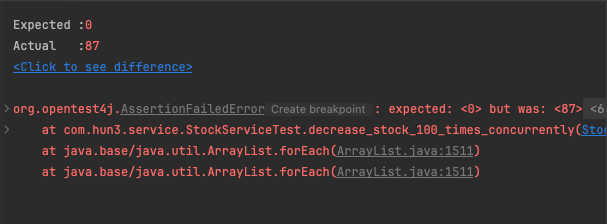

왜 실패했을까?
작업을 반영할 때 버전이 일치하지 않는 다면 충돌을 감지한다면 예외가 발생하기 때문이다.

```command
2025-06-21T17:14:42.519+09:00 ERROR 39999 --- [stock-concurrency] [pool-2-thread-2] c.h.s.OptimisticLockStockServiceTest     : ObjectOptimisticLockingFailureException 발생, 업데이트 실패

org.springframework.orm.ObjectOptimisticLockingFailureException: Row was updated or deleted by another transaction (or unsaved-value mapping was incorrect): [com.hun3.domain.Stock#1]
```

그렇다면 이 경우에는 어떻게 해야할까?
업데이트가 실패하고 애플리케이션 레벨에서 다시 데이터를 조회한 후 업데이트를 수행해야 한다.

따라서, 다시 재고 데이터를 조회하고 업데이트를 수행할 객체를 구현해야 한다.

```java
@Slf4j
@Component
public class OptimisticLockStockFacade {

    private final OptimisticLockStockService optimisticLockStockService;

    public OptimisticLockStockFacade(OptimisticLockStockService optimisticLockStockService) {
        this.optimisticLockStockService = optimisticLockStockService;
    }

    public void decrease(Long productId, Long quantity) throws InterruptedException {
        while(true) {
            try {
                optimisticLockStockService.decrease(productId, quantity);
                break;
            } catch (ObjectOptimisticLockingFailureException e) {
                log.error("{} 발생, 업데이트 실패", e.getClass().getSimpleName(), e);
                Thread.sleep(50);
            }
        }
    }
}
```

### Named Lock

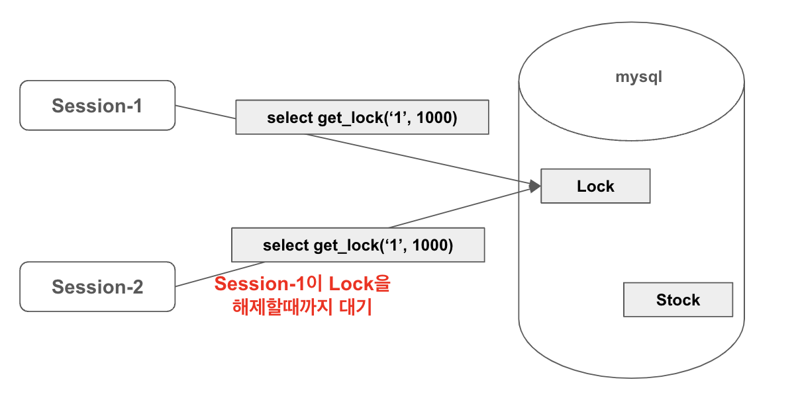

metadata 락 기법으로 이름을 가진 Lock을 획득한 세션만 접근한다.

Transaction이 종료될 때 Lock이 자동으로 해제되지 않기 떄문에 TTL을 두어 사용하거나 별도로 명령어를 통해 해제를 해줘야 한다.

```java
public interface LockRepository extends JpaRepository<Stock, Long> {
	@Query(value = "select get_lock(:key, 3000)", nativeQuery = true)
	void getLock(String key);

	@Query(value = "select release_lock(:key)", nativeQuery = true)
	void releaseLock(String key);
}
```

> 실무에서는 비즈니스 로직과 동일한 DataSource로 사용할 경우에는 Connection Pool 이 부족해져 다른 서비스에 영향을 줄 수 있다고 한다.
> DataSource를 분리해서 사용할 것을 추천한다.

### JPA @LOCK

Java는 이러한 데이터베이스 락 기법을 사용할 수 있도록 `LockModeType`을 제공한다.

자세한 내용은 [공식 문서](https://docs.oracle.com/javaee/7/api/javax/persistence/LockModeType.html)를 참고하자.

> 낙관적 락은 충돌 가능성이 적은 환경에 적합하며, 비관적 락은 동시 수정 가능성이 높을 때 안전합니다.

--- 

## 3. Redis Lock

Redis를 활용해서 동시성 문제를 해결할 수 있다.
`Lettuce`와 `Redisson`을 활용해 해결해 보자.

### Lettuce

`Lettuce`로 분산 락을 구현하는 경우 `setnx` 명령어를 활용한다.
이 떄, Spin Lock 방식으로 구현하는데, retry 로직을 개발자가 직접 작성해야 한다.

- setnx : set if not exists
- key-value를 기준으로 기존의 값이 없는 경우 set 한다.

Spin Lock
- 스레드가 Lock을 획득하기 위해 반복적으로 시도하는 기법.
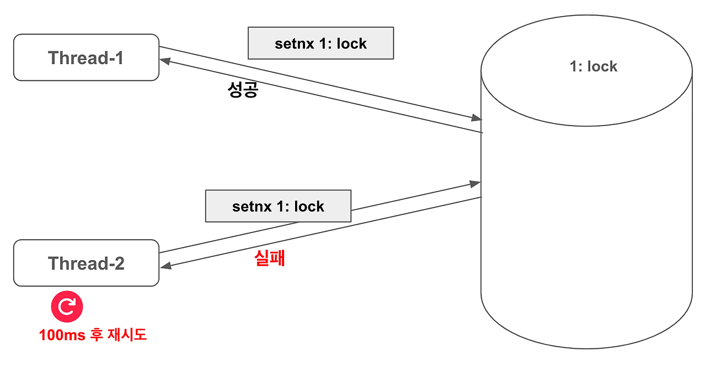

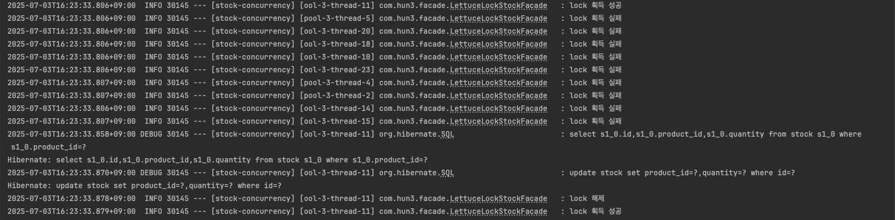

첫 스레드가 Lock 을 반납하기 전까지 획득에 실패하는 것을 볼 수 있다.

또한 스레드가 Lock을 해제하면 다른 스레드가 락을 획득 해 동작하는 것을 볼 수 있다.

하지만, Spin Lock 방식이므로 스레드가 Lock을 획득하기 위해서 계속 레디스에 요청을 보내 부하를 줄 수 있기 때문에 Thread.sleep()을 통해 Lock을 시도하는 중간에 텀을 두어야 한다.

### Redisson

pub-sub 기반으로 Lock을 구현한다.

pub-sub
- Lock을 관리하기 위한 채널을 생성해 Lock을 점유중인 쓰레드가 작업이 끝나면 Lock을 획득하려 대기중인 쓰레드에게 해제를 알린다.
- 이 후 안내 받은 쓰레드가 Lock을 획득하는 시도를 한다.
- Lettuce와 달리 별도의 Retry 로직을 작성하지 않아도 된다.

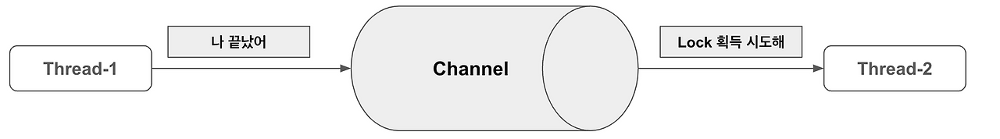

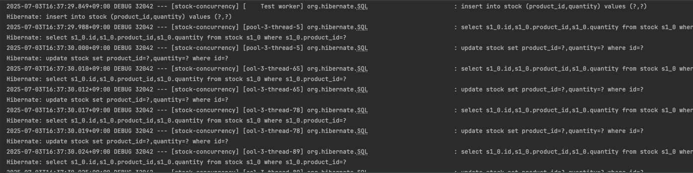

Spin Lock 방식의 Lettuce와 달리 pub/sub 기반으로 레디스에 부하를 줄일 수 있다.
하지만 구현 로직이 복잡하고, 별도의 외부 라이브러리를 사용하므로 사용법을 익혀야 한다는 부담이 존재한다.

> 재시도가 필요하지 않다면 Lettuce를, 별도의 재시도 로직이 필요하다면 Redisson을 활용할 수 있다.

## Reference

---

[재고 시스템으로 알아보는 동시성 이슈 해결방법](https://nooblette.tistory.com/entry/%EC%8B%9C%EC%8A%A4%ED%85%9C-%EB%94%94%EC%9E%90%EC%9D%B8-%EC%9E%AC%EA%B3%A0%EC%8B%9C%EC%8A%A4%ED%85%9C%EC%9C%BC%EB%A1%9C-%EC%95%8C%EC%95%84%EB%B3%B4%EB%8A%94-%EB%8F%99%EC%8B%9C%EC%84%B1%EC%9D%B4%EC%8A%88-%ED%95%B4%EA%B2%B0%EB%B0%A9%EB%B2%95-13-%EB%AC%B8%EC%A0%9C-%EC%9D%B8%EC%8B%9D%EA%B3%BC-Application-Level%EB%A1%9C-%ED%95%B4%EA%B2%B0%ED%95%98%EA%B8%B0)